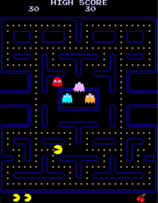

# pac
 PacMan Arcade Game based on Z80 emulator with original ROMs

A [Pac-Man (1980 arcade game)](https://en.wikipedia.org/wiki/Pac-Man) emulator written in C99 with the SDL2.

Features:

- [x] full emulation
- [x] sound emulation
- [x] two-player mode
- [x] joystick support
- [x] Multi platform Win & Linux
- [X] Visual Studio 2022 & VS Code

## How to build

You should be able to build it and running:

- Under Windows use Visual Studio 2022
- Under Linux use VS Code

## How to play

| Computer    | pac                           |
| ----------- | ----------------------------- |
| 5 or c      | insert a coin for Player 1    |
| 6 or v      | insert a coin for Player 2    |
| 1           | start a game (1 player)       |
| 2           | start a game (2 players)      |
| arrow keys  | move the player               |
| p           | pause the emulation           |
| m           | mute audio                    |
| s           | take a screenshot             |
| t           | run the board test            |
| space       | run the emulation at x2 speed |
| i           | toggle invincibility mode     |
| GamPad/Joy  | try it and have fun!          |
| ----------- | ----------------------------- |

## Resources

- https://www.lomont.org/software/games/pacman/PacmanEmulation.pdf
- https://www.arcade-history.com/?n=pac-man-model-932&page=detail&id=1914
- http://www.arcaderestoration.com/memorymap/6365/Pac-Man.aspx
- http://umlautllama.com/projects/pacdocs/
- https://simonowen.com/articles/pacemu/

## 
This is the original repo here: https://github.com/superzazu/pac.git
I didn't want to fork it because of a lot of changes were made...sorry
